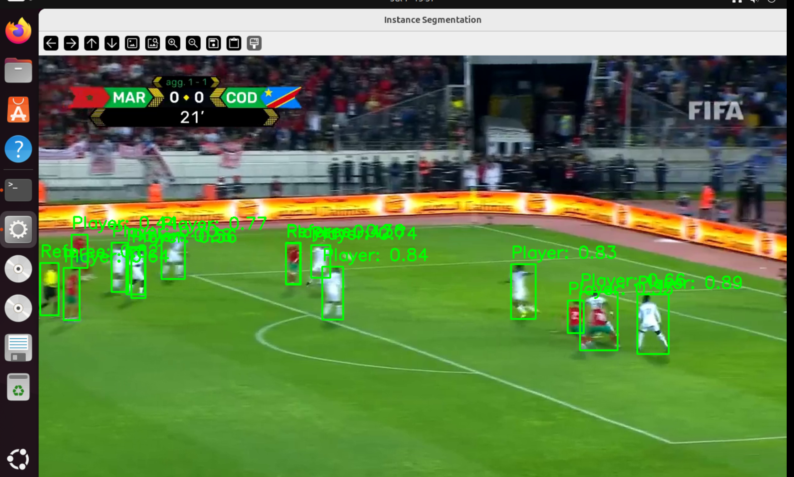

# Football Instance Segmentation and Object Detection

Real-time instance segmentation and object detection for football matches, capable of detecting and segmenting players, ball, goalkeeper, referee, and other football-related objects in live video streams.

## 🎯 Features

- **Real-time Detection**: Process live video streams with minimal latency
- **Multi-class Detection**: Identifies players, ball, goalkeeper, referee
- **Instance Segmentation**: Precise pixel-level segmentation masks
- **YOLOv8 Integration**: Leverages state-of-the-art YOLO architecture
- **GPU Acceleration**: CUDA support for enhanced performance

## 📸 Preview

### Detection Results

*Football match with detected players and objects*


*Instance segmentation showing precise player boundaries*


*Multi-object detection in action*

## 🎥 Demo Video

Check out the real-time detection in action:
- **Demo Video**: `video3.mp4` - Shows live instance segmentation and object detection on football footage

## 🚀 Quick Start

### Prerequisites
```bash
pip install ultralytics opencv-python torch torchvision
```

### Usage
```python
python test.py
```

This will process `video3.mp4` and generate `output.avi` with detection results.

## 📁 Project Structure

```
├── preview/                 # Example detection results
│   ├── exemple1.png
│   ├── example2.png
│   └── example3.png
├── train2/                  # Training artifacts
│   └── weights/
│       ├── best.pt         # Best trained model
│       └── last.pt         # Latest checkpoint
├── test.py                 # Basic detection script
├── test2.py               # Alternative implementation
├── test3.py               # Enhanced version
├── test4.py               # GPU-optimized version
├── video3.mp4             # Demo input video
└── yolov8n.pt            # Base YOLO model
```

## 🔧 Model Details

- **Architecture**: YOLOv8 with instance segmentation
- **Input Size**: 640x640
- **Confidence Threshold**: 0.25
- **Classes**: Players, Ball, Goalkeeper, Referee
- **Trained Weights**: `train2/weights/best.pt`

## 🎮 Controls

- Press `q` to quit the video processing
- Output is saved as `output.avi`

## 📊 Performance

The model achieves real-time performance on modern GPUs with accurate detection and segmentation of football-related objects.

## 🤝 Contributing

Feel free to contribute by improving the model accuracy, adding new classes, or optimizing performance.

## 📄 License

This project is open source and available under standard licensing terms.